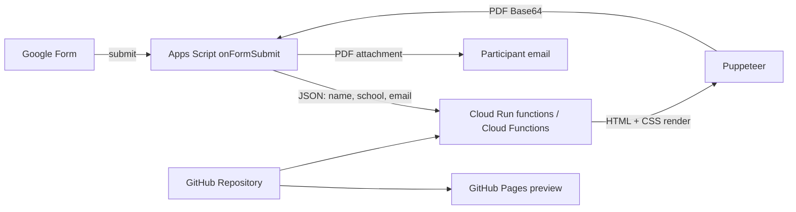

# 設計図

## 分担

- デザイン: `public/index.html` と `public/assets/certificate.css`
- 公開プレビュー: GitHub Pages
- PDF生成: `functions/index.js`
- フォーム連携: `apps-script/FormWebhook.gs`

## セキュリティ上の注意

- `WEBHOOK_API_KEY` はGitHubへコミットしないでください。
- Googleフォーム回答には個人情報が含まれるため、GitHub Pages側には回答データを保存しません。
- Cloud Functionを `--allow-unauthenticated` にする場合でも、`X-Api-Key` を必ず検証してください。
